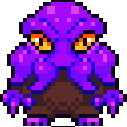
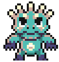
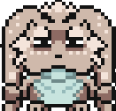
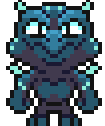
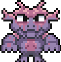
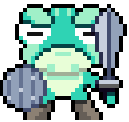
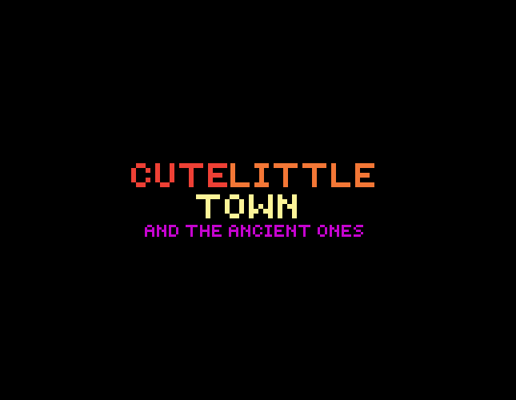
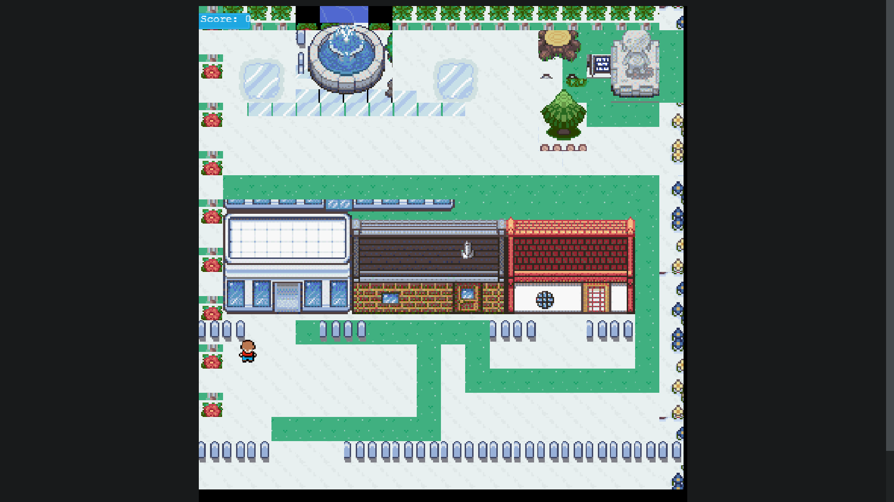

# 🕹️ RPG-game

This project is part of a series of projects to be completed by students of [Microverse](https://www.microverse.org/).

This project focuses on creating a RPG videogame with the Phaser 3 library

## 🧮 The Project Brief

A RPG horror game where you have to fight against The Ancient Ones


## 🖼️🖌️ Game Design

### The game Lore

Our Hero (Regular Guy) enjoyed occultism and satanic rites, one day by mistake he invoked the ancients, who now spread their terror throughout LittleCuteTown; your heroic task is to defeat them all, before all its inhabitants fall into an abyss of despair. 


### 🎮 How to play the game 

1. Walk trought the map using the arrow keys of your keyboard to find the spots where The Ancient Ones have left a trail of madness.

2. Fight them.

3. Destroy them all and safe CuteLittleTown from the abyss of dispair, or face and find your death against them.

### Fighting 

When you get switched to the Battle Field you will see your Regular guy's back on the bottom side of the screen. And The Ancient one in front of him 
At the bottommost of the screen you will see a text button turning yellow when is your turn to attack, and turning white when is the enemies turn.
When is your turn you have to press the **SpaceBar** to attack the enemy.
After each character attacks you'll see a message displaying the name and the damage inflicted by the player who made the attack. 

When the battle finishes you get switched back to CuteLittleTown, or to the Game Over screen, depending on the outcome of the battle.


### Assets

All of the sprites, backgrounds buttons and background music can be found on the bundle for racial justice and equiality  at [itch.io](https://itch.io/b/520/bundle-for-racial-justice-and-equality)

Map designed by me ussing the [Tiled Software](https://www.mapeditor.org) and a lot of love 💜


### Characters

#### Hero
---
<h4 align="center">
  Regular guy
</h4> 
  
<p align="center">
  
</p>


#### Enemies

---
<h4 align="center">
  Cutulhu
</h4> 
  
<p align="center">
  
</p>

---
<h4 align="center">
  Saint Axolotl
</h4> 
  
<p align="center">
  

</p>

---
<h4 align="center">
  Bunny of Death
</h4> 
  
<p align="center">
  
</p>

---
<h4 align="center">
  Crazy Lizzard
</h4> 
  
<p align="center">
  

</p>

---
<h4 align="center">
  Wiked Demon
</h4> 
  
<p align="center">
  
</p>

---
<h4 align="center">
  Toad
</h4> 
  
<p align="center">
  
</p>

## 📽️ Previews

<p align="center>

<a href="assets/game-logo.png"></a>

> Start Game Scene

********

<p align="center>

<a href="assets/world.png"></a>

> World

********

<p align="center>

<a href="assets/bossBattle.png"></a>

> Boss Battle


*********

## 🧬 Technologies & Languages Used

- Javascript
- ESLint
- StyleLint
- Phaser 3 Framework
- Stickler CI
- Jest Framework

## 🔰 Setup & Usage

### Setup
To view the project in action, follow [this link to the live website](https://psiale.github.io/rpg-game/
) or 
1. download the repository and run ``` npm run build ``` and then ``` npm run start  ```
2. open your [localhost](localhost:8080) to play the game locally.

## 🛎️ Contributions, Issues & Forking

If you have any issues setting up the project or you come across any unintended bugs or problems, please do submit an issue to the [RPG game](https://github.com/Psiale/rpg-game/issues) page.

If you want to make your own changes, modifications or improvements to our project, go ahead and Fork it!
1. [Fork it](https://github.com/Psiale/rpg-game/fork)
2. Create your working branch (git checkout -b [choose-a-name])
3. Commit your changes (git commit -am 'what this commit will fix/add/improve')
4. Push to the branch (git push origin [chosen-name])
5. Create a new Pull Request

## 🤟🏽😄 😛🤙🏾  Creator

Alexis Sanchez

[Github](https://github.com/Psiale)

[Linkedin](https://www.linkedin.com/in/alexis-sanchez-dev/)


## 🙌🏾 Show Your Support

Give a ⭐️ if you like this project!