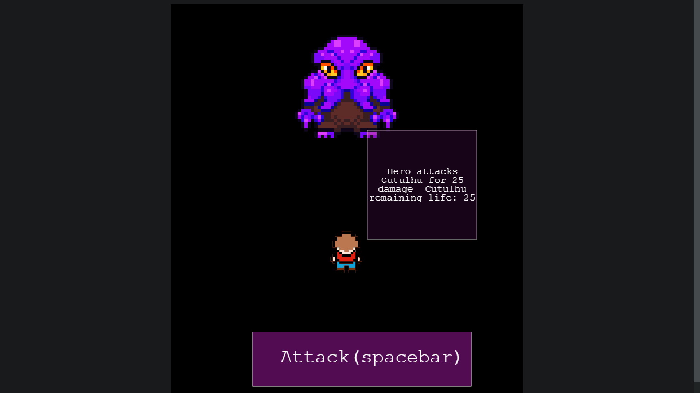

# 🕹️ RPG-game

This project is part of a series of projects to be completed by students of [Microverse](https://www.microverse.org/).

This project focuses on creating a RPG videogame with the Phaser 3 library

## 🧮 The Project Brief

A RPG horror game where you have to fight against The Ancient Ones

## 📽️ Previews

> Start Game Scene

********

> World

********

> Boss Battle

*********

## 🧬 Technologies & Languages Used

- Javascript
- ESLint
- StyleLint
- CSS/SASS
- Stickler CI
- Jest Framework

## 🔰 Setup & Usage

### Setup
To view the project in action, follow [this link to the live website](https://raw.githack.com/Rhelli/Javascript-Tic-Tac-Toe/feature/linters/index.html
) or download the repository and open the HTML file with your browser of choice (we'd recommend Chrome).

## 🛎️ Contributions, Issues & Forking

If you have any issues setting up the project or you come across any unintended bugs or problems, please do submit an issue to the [Book Library](https://github.com/Rhelli/Javascript-Tic-Tac-Toe/issues) page.

If you want to make your own changes, modifications or improvements to our project, go ahead and Fork it!
1. [Fork it](https://github.com/Rhelli/Javascript-Tic-Tac-Toe/fork)
2. Create your working branch (git checkout -b [choose-a-name])
3. Commit your changes (git commit -am 'what this commit will fix/add/improve')
4. Push to the branch (git push origin [chosen-name])
5. Create a new Pull Request

## 🤟🏽😄 😛🤙🏾  Creators

Alexis Sanchez - [Github](https://github.com/Psiale)

Rory Hellier - [GitHub](https://github.com/Rhelli)

## 🙌🏾 Show Your Support

Give a ⭐️ if you like this project!